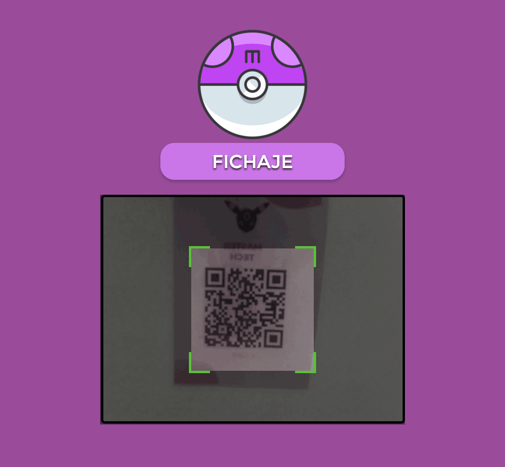

# TimeClock

_TimeClock_ is a small clocking web app for workers using a Microsoft Access Database. Workers clock in with a QR code or Aztec Code.

This uses the [Html5-QRCode](https://github.com/mebjas/html5-qrcode) library for code reading.
The connection to Microsoft Access database is made through [pyobdc](https://pypi.org/project/pyodbc/) library.



## Installing dependencies

```
pip install -r requirements.txt
```

## Running the app

```
uvicorn app.main:app --reload
```

## Why make this?

This was a group challenge for my class, and I thought it would be cooler to make the clocking in with a card than a Microsoft Access form.

## Reading the docs

To read the API docs, open the following pages:

-  [`/docs`](http://127.0.0.1:8000/docs) for classic OpenAPI docs
-  [`/redoc`](http://127.0.0.1:8000/redoc) for more modern ReDoc docs
